# MoviesList

MoviesList est une application mobile développée en React-Native et utilisant l'API de TMDB. Elle permet de rechercher les derniers films populaires, decouvrir leurs synopsis, note ainsi que leurs acteurs! Mais surtout, elle vous permet d'ajouter les films que vous souhaitez voir à une watchlist, et même, pour les films que vous avez déjà vu, de les ajouter à vos favoris.

## Disclaimer

Tous les tests ont été réalisés avec un compte TMDB personel, tout comme le Token API et le Bearer Token. Ainsi, si vous souhaitez utiliser cette application avec votre compte personnel TMDB, il vous faudra demander une clé API et la renseigner dans un .env à la racine du projet : MoviesList/.env

```ini
# Fichier .env
TMDB_API_KEY=votre_clé_api
TMDB_ACCESS_TOKEN=votre_bearer_token
```

## Documentation

### 📱 Navigation

À l'ouverture de l'application, vous vous retrouver sur la page de login. Il vous faudra donc un compte TMDB pour utiliser l'application. Également, un token API ainsi qu'un bearer token sera nécessaire pour profiter entièrement de l'application.

<p style="text-align: center;">
    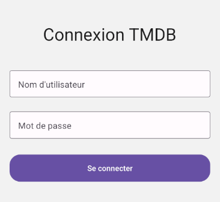
</p>


Après votre connexion, vous vous retrouvez dans l'onglet Accueil. Il est possible naviguer entre 3 onglets, l'Accueil, votre Watchlist et votre Profil.

<p style="text-align: center;">
    
</p>

### 🎥 Navigation dans les films populaires

Dans l'écran d'accueil, une multitude de films populaires vous est proposée. Vous pouvez faire défiler vers le bas pour les découvrir. 

<p style="text-align: center;">
    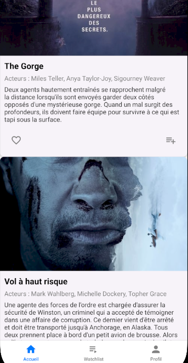
</p>

Une barre de recherche se trouve en haut de l'écran vous permettant de faire une recherche parmi ces films.

<p style="text-align: center;">
    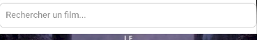
</p>

### ➕ Ajout à la Watchlist et aux Favoris

Sur la carte de chaque film se trouve deux boutons. Le premier à gauche, un icône de coeur 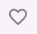, qui permet d'ajout ce film à votre liste de favoris. Lorsque le coeur est vide (  ) le film ne fait pas parti de vos favoris, tandis que lorsqu'il est rempli ( 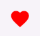 ), le film se trouve déjà dans vos favoris.

Le second, à droite, icône de liste 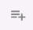, qui permet d'ajout ce film à votre Watchlist. Lorsque l'icône est gris (  ) le film ne fait pas parti de votre Watchlist, tandis que lorsque c'est un check bleu (  ), le film se trouve déjà dans votre Watchlist.

A savoir, votre watchlist et votre liste de favoris sont synchronisées avec le site de l'API, TMDB. C'est-à-dire que si vous ajoutez un film à vos favoris depuis le site TMDB, ils seront retrouvables dans votre application.

### 📋 Détails d'un film

En cliquant sur le film de votre choix, vous serez redirigé vers l'écran de détails de ce film. Vous y retrouverez différentes informations, comme l'affiche complète du film, le synopsis, les acteurs, les genres, la note ainsi que des films recommandés.

<p style="text-align: center;">
    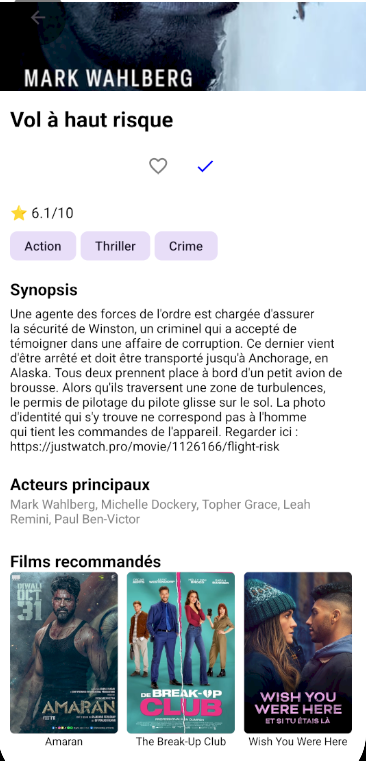
</p>

### 👁️ Watchlist

Depuis l'écran d'accueil, l'onglet Watchlist est accessible.
<p style="text-align: center;">
    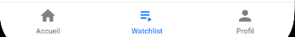
</p>

Vous retrouvez sur cet écran tous vos films ajoutés à votre Watchlist.
<p style="text-align: center;">
    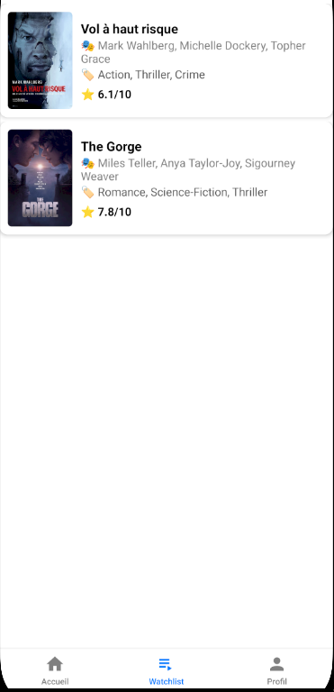
</p>

En faisant un slide sur la gauche sur un film, il vous sera possible de le supprimer de votre Watchlist.
<p style="text-align: center;">
    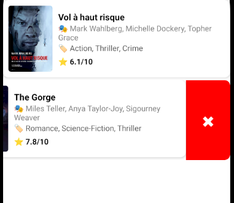
</p>

Il vous suffira ensuite d'appuyer sur la croix puis de confirmer votre choix pour que le film sont suppriém de votre Watchlist.
<p style="text-align: center;">
    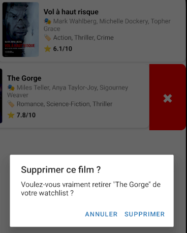
</p>


### ❤️ Favoris

Depuis l'écran d'accueil, l'onglet Profil est également accessible.

<p style="text-align: center;">
    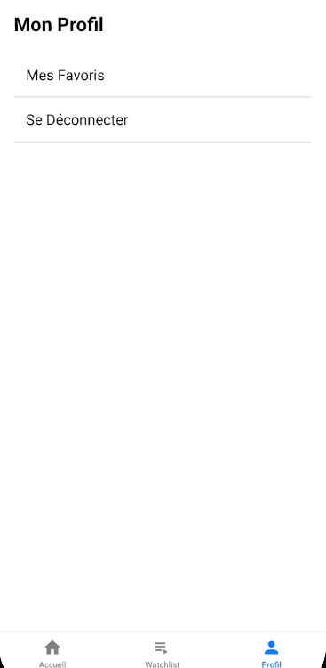
</p>

C'est ici que votre liste de favoris est consultable. Elle contient les films que vous avez ajoutés dans votre liste de favoris.

<p style="text-align: center;">
    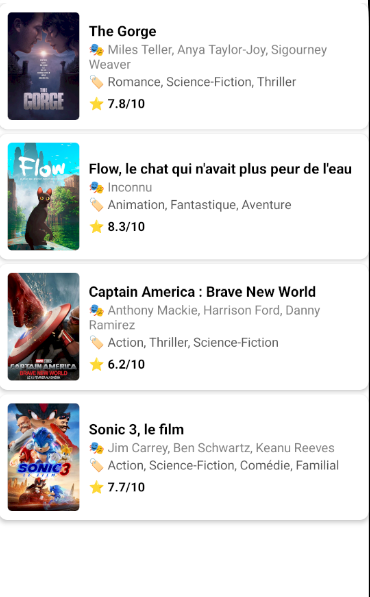
</p>

Il suffit d'un slide vers la droite pour revenir à l'écran précédent.


### ❌ Déconnexion

Depuis l'écran Profil il est également possible de se déconnecter de votre compte TMDB ainsi que de l'application. Vous serez alors redirigé vers la page de connexion.
